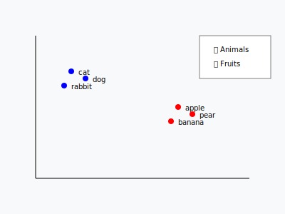
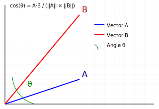

# Let's talk about RAG

> RAG = Retrieval Augmented Generation

## Helping the model remember large amounts of information
- Language models have a **context limit** (e.g., 4K, 16K, [32K tokens](https://qwenlm.github.io/blog/qwen2.5-llm/#model-card))
- By breaking information into **chunks**, we can **store** and **retrieve**
  information **beyond** this limit.
- **Better focus**
- **Less data to load**

## Embedding ? 🤨

An embedding = transforming data (e.g.: text) into vectors of numbers. 

## Mathematical representation

Giving "coordinates" to data to place them in a mathematical space where:
- **Similar** elements are **close**
- **Different** elements are **distant**



## Usefulness

**Semantic search**
- Find similar documents
- Search for similar images 
- Recommend similar products
- ...

## Embedding Models?

Embedding models are neural networks that convert text, images, or other data into dense numerical vector representations that capture semantic meaning, enabling machines to understand and compare the similarity between different pieces of content.

## Cosine Distance between 2 vectors

- **Cosine distance** measures the **similarity** between two vectors by calculating the cosine of the angle separating them.
- The more similar the vectors are, the closer the cosine will be to 1.

### Key points

- The distance ranges between `-1` and `1`
- `1` means the vectors are identical (same direction)
- `-1` means they point in opposite directions




## Demos

Try these demos:

```bash 
cd 07-let-s-talk-about-rag
```

### 01.main.js
Demonstrates basic similarity search by converting text chunks and a user question into embeddings, then calculating cosine similarity between them to find which chunks are most relevant to the question.

```bash 
node 01.main.js
```

### 02.main.js
Shows how to build a simple vector store by creating embeddings for text chunks, storing them, and then searching for the most similar chunks to a user query using similarity thresholds.

```bash 
node 02.main.js
```

### 03.main.js
Implements a complete RAG (Retrieval Augmented Generation) system that combines similarity search with a chat model - it finds relevant documents based on the user question and uses them as context to generate a response.

```bash 
node 03.main.js
```