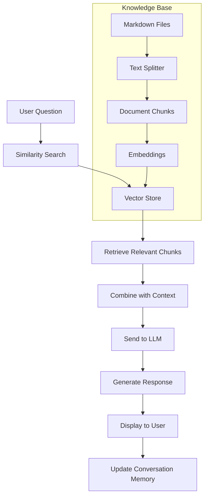
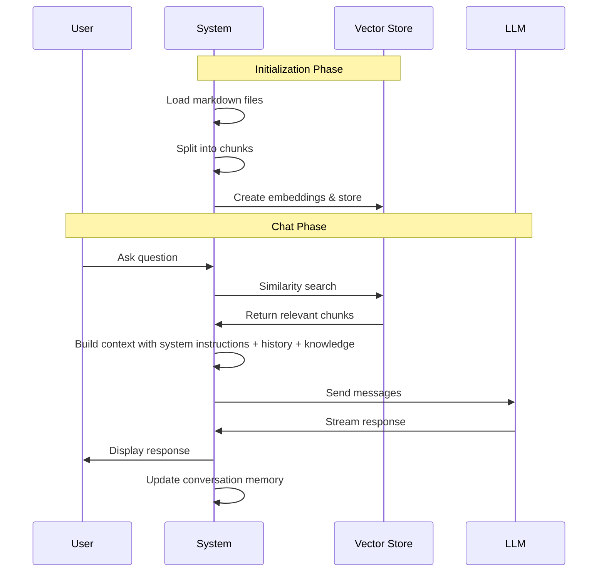

# Make a better Hawaiian pizza expert with RAG

Have a look to the source code of this project. It is based on the previous project `06-add-more-context` but now we use RAG (Retrieval Augmented Generation) to provide more appropriate context to the model (smaller content).

## Source code

The `index.js` file implements a RAG (Retrieval Augmented Generation) system that creates a pizza expert chatbot. Here's what the code does:

1. **Setup**: Initializes OpenAI chat and embedding models using local endpoints
2. **Document Processing**: Loads markdown files from the data directory and splits them into chunks using RecursiveCharacterTextSplitter
3. **Vector Store Creation**: Creates embeddings for each text chunk and stores them in a MemoryVectorStore for similarity search
4. **Interactive Loop**: Runs a continuous chat interface where users can ask questions
5. **RAG Pipeline**: For each user question, it performs similarity search to find relevant knowledge, then sends the question along with the retrieved context to the LLM
6. **Memory Management**: Maintains conversation history with configurable limits

### System Architecture



### Data Flow



## Demo

```bash 
cd 08-pizza-expert-with-rag
```

```bash 
node index.js
```

### Play with the pizza expert

Open the file `data/hawaiian-pizza-knowledge-base.md` and try to ask questions about the Hawaiian pizza.

### Play more

- Copy the file `/examples/crazy-pizza-recipes.md` to the `data` directory and restart the app. 
- Now you have more knowledge about the "Crazy" pizzas 🤪.
- Try to ask questions about these crazy pizzas.
