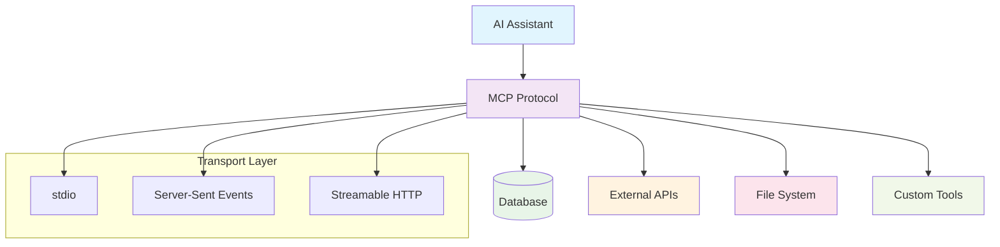
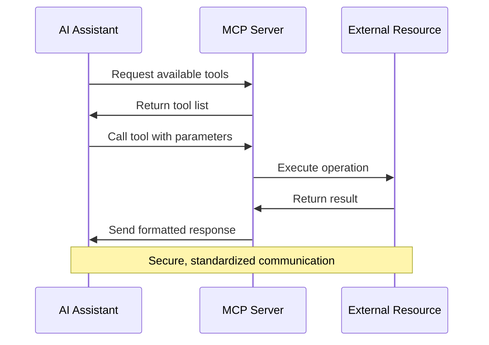

# Model Context Protocol

> MCP Hello World Server (in Golang)

## Model Context Protocol (MCP)?

### What is MCP?

Model Context Protocol (MCP) is an open standard that enables secure connections between AI assistants and external data sources and tools. Think of it as a universal translator that allows AI models to safely interact with your applications, databases, and services.

### Why MCP?

**The Problem:**
- AI assistants are often isolated from real-world data and tools
- Each integration requires custom development and security considerations
- Developers need to build separate connectors for different AI models
- Data access patterns are inconsistent and hard to manage

**The Solution:**
- MCP provides a standardized way for AI models to access external resources
- Eliminates the need for custom integrations for each AI assistant
- Ensures secure, controlled access to sensitive data and operations
- Enables seamless tool calling and data retrieval

### Key Advantages

- **Standardization**: One protocol works across different AI assistants
- **Security**: Built-in authentication and permission controls
- **Flexibility**: Supports various data sources and tool types
- **Scalability**: Easy to add new capabilities without changing core logic
- **Developer-friendly**: Simple API design with clear specifications

### Transport Types

MCP supports different transport mechanisms:

- **stdio**: Standard input/output communication for local process integration
- **SSE (Server-Sent Events)**: One-way streaming from server to client over HTTP
- **Streamable HTTP**: Request/response communication over HTTP protocols

### MCP Architecture Overview



### MCP Communication Flow




## Start the MCP server

```bash 
cd 11-mcp-hello-world-server
```

```bash 
docker compose up
```

### Test the MCP server with `curl`

> In another terminal:

Get the list of tools:
```bash 
cd tests
./tools.list.sh
```

Call the **hello world** tool:
```bash 
./tool.call.hello-world.sh
```

Call the **hello** tool:
```bash 
./tool.call.hello.sh
```

## Exercise: add a greeting tool

Add a `greeting` tool that takes two parameters: `firstname` and `lastname`, and returns a greeting message.

Rebuild and restart the server:
```bash 
docker compose up --build
```

Test the `greeting` tool:
```bash 
cd tests
./tool.call.greeting.sh
```


## Docker-in-Docker Note

If you are running this project from within a Docker container (docker-in-docker), you will need to use `host.docker.internal` instead of `localhost` in the test scripts to access the MCP server. This is necessary because `localhost` inside a container refers to the container itself, not the Docker host.

<!--
Si vous exécutez ce projet depuis un conteneur Docker (docker-in-docker), vous devrez utiliser `host.docker.internal` au lieu de `localhost` dans les scripts de test pour accéder au serveur MCP. Cela est nécessaire car `localhost` dans un conteneur fait référence au conteneur lui-même, pas à l'hôte Docker.
-->
