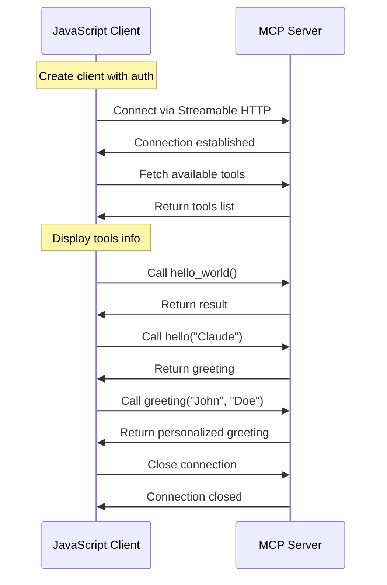

# Connect MCP server with JavaScript client

**🤚 Do not stop the MCP server from the previous exercise.**

## What does index.js do?

The `index.js` program demonstrates how to create a JavaScript client that connects to an MCP server using the Streamable HTTP transport. It:

- Creates an MCP client with authentication (Bearer token)
- Connects to the MCP server via HTTP
- Fetches and displays available tools from the server
- Tests each tool by calling them with sample parameters:
  - `hello_world` tool (no parameters)
  - `hello` tool (with name parameter)
  - `greeting` tool (with firstname and lastname parameters)
- Handles errors gracefully and closes the connection when done

### Communication Flow




## Demo: try it yourself

```bash terminal-id=terminal-12-01
cd 12-connect-mcp-server-with-js
```

```bash terminal-id=terminal-12-02
node index.js
```

